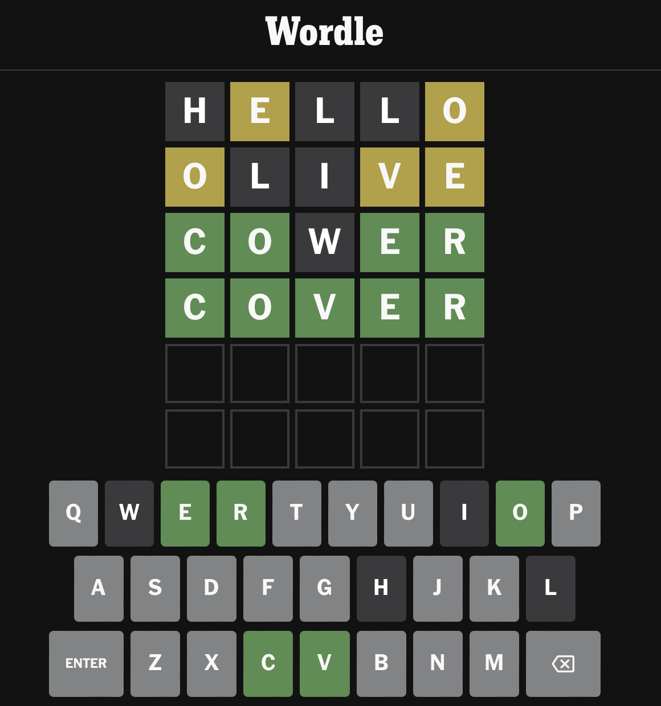
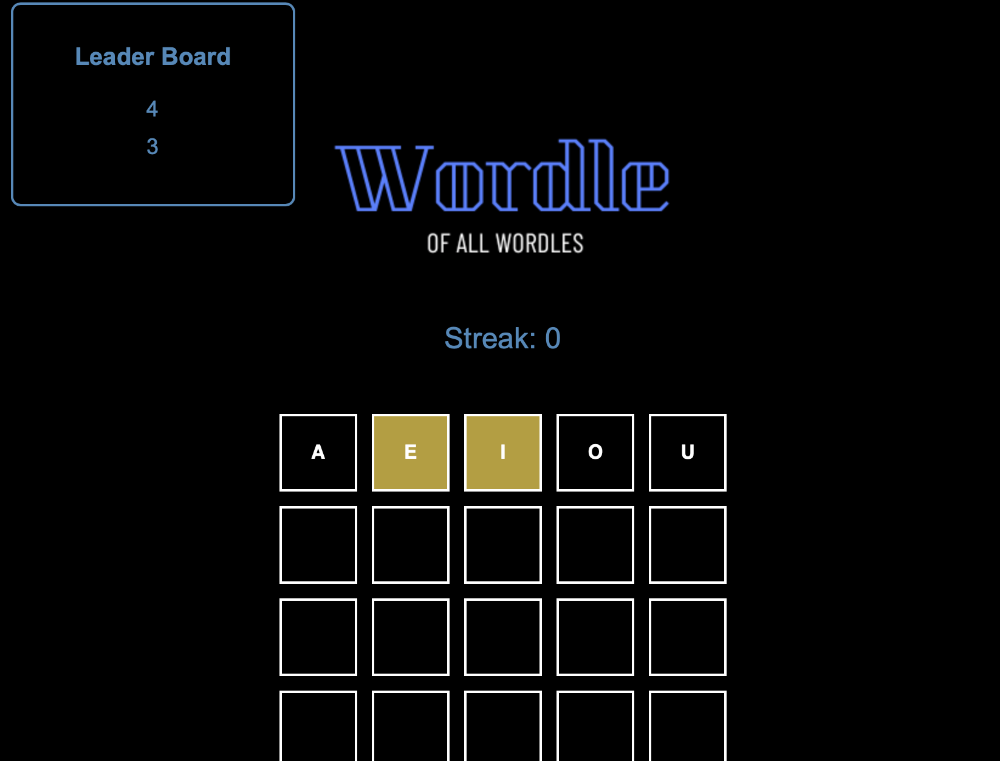

# CSI3140 - Wordle Design Document

This document will detail the design decisions made in creating our Wordle game, which will include structure of code and visual components.

> Project done by **Mustafa Ahmed** & **Justin Wang** \
> July 16th, 2024 \
> A3

## Overview

This is our adaptation of Wordle, a popular New York Times game where user's must try to guess a five letter word in 6 attempts or less. \
Our game will follow the same rules:

- You have 6 attempts to find the word.
- In each guess, if there are letters in the word that exist in the actual word but in the wrong position, it will be highlighted yellow.
- If it exists and is in the same position, it will be highlighted green.

We have added a simple scoring system ourselves:

- Consecutive correct guesses add to a streak
- Upon a wrong guess your streak will be added to the leaderboard and reset
<picture>
 <source media="(prefers-color-scheme: dark)" srcset="../docs/wordle_example.png">
 <source media="(prefers-color-scheme: light)" srcset="../docs/wordle_example.png">
 
</picture>

## How to Play

1. With PHP downloaded on your computer, navigate to the v02 directory on your terminal.

2. In the terminal, type the following cmd to deploy a PHP server at localhost 3000: `php -S localhost:3000` (use `killall -9 php` to turn off PHP server).

3. With the server now running, navigate to `http://localhost:3000/index.html` in you chosen web browser.

4. Begin guessing words using your keyboard!
   

     
   

## Structural Component Breakdown

### HTML

Our `index.html` file displays our board and all core game elements. We know that our board will be 6 rows and 5 columns, so the board was coded within our HTML file. Each block in each column was created in the HMTL file, with it's own set id, to keep track of each position in the JS document.

The streak counter is placed above the game board as a regular text output. The leaderboard is placed in the top left corner of the screen as a fixed side-bar that outputs an ordered list of scores. Both elements have unique ids for styling and are dynamically updated as the game is played.

### PHP

All game data and logic is hosted and managed in a PHP `$_SESSION`. The PHP server logic is implemented in the `server.php` file. \
The server implements:

- The word list
- Storing of the secret word
- Tracking of the current row/column in play
- Verifying guesses
- Tracking user input
- Game state management

All of these functionalities are communicated to the Javascript side using AJAX where the data is correctly manipulated to output to the user.

### Javascript

The Javascript file `index.js` bridges the php server to the html output. It makes AJAX calls to the PHP server to retrieve data for game logic and game state tracking.

It implements some logic for user output such as sorting the leaderboard list before outputting.

These values are used by all functions in our program to check the actions and inputs done by the user.

### CSS / Design

#### Distribution of Elements

- The `gameBoard` element is placed in the centre of the screen as it is the main point of interaction for the user
- The `streak-counter` element is placed just above the game board so the user can easily see their game progress as they play
- The `leaderboard-list` element is placed in the top left corner so that it does not get in the way of the user during gameplay but can be referred to at any time.

#### Colour Palette

Our _colour palette_ stays true to the real Wordle game:

- The background colour is **black** (`rgb(0, 0, 0)`)
- The grid colour is **white** (`rgb(255, 255, 255)`)
- The leaderboard, and streak counter is a shade of **blue** (`#5587b9`)
- The **yellow** used to indicate the correct letter in the wrong place is the same as in the real game (`rgb(180,159,59)`)
  - This yellow contrasts the white of our letters and can be easily seen by users playing our game
- The **green** used to indicate the correct letter in the right place is the same as in the real game (`rgb(97,140,85)`)

#### Font

For the game board the _font_ used is sans-serif, **bolded**, CAPITALIZED, and in the colour white (`rgb(255, 255, 255)`).

- This is close to how the actual game is, the font is different but the other characteristics are still present in our adaptation

For the leader board and streak counter the _font_ used is also sans-serif but in the shade of blue to match the title card(`#5587b9`).

#### Assets

The only asset used for our project is a custom logo placed at the top of our game.

  

