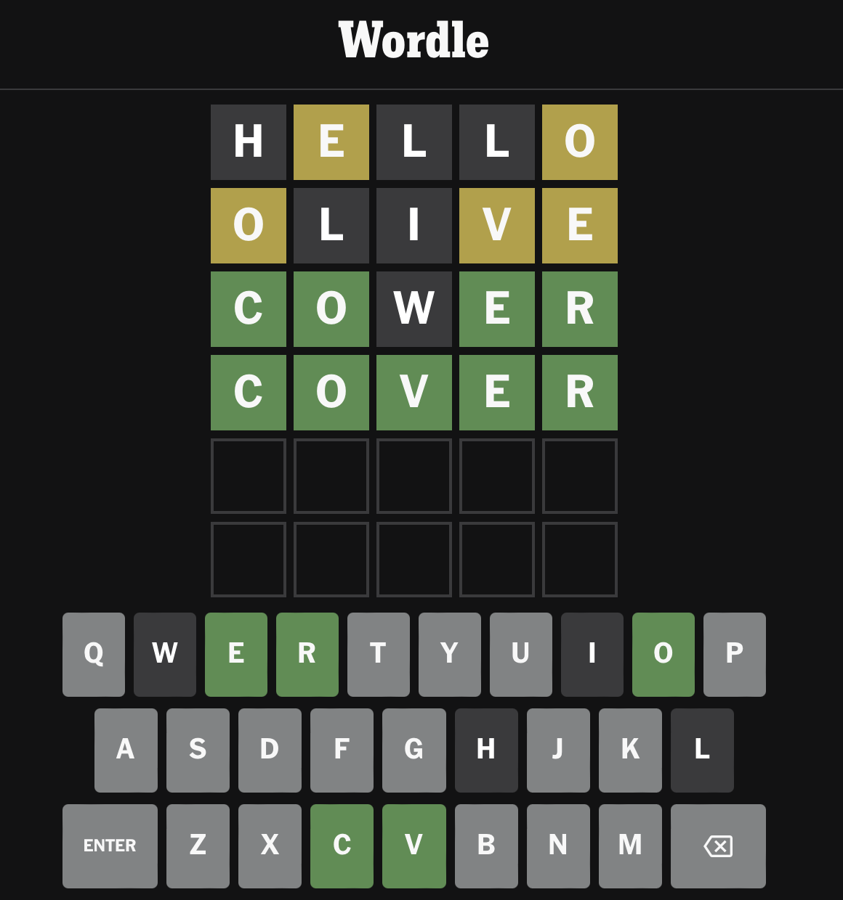
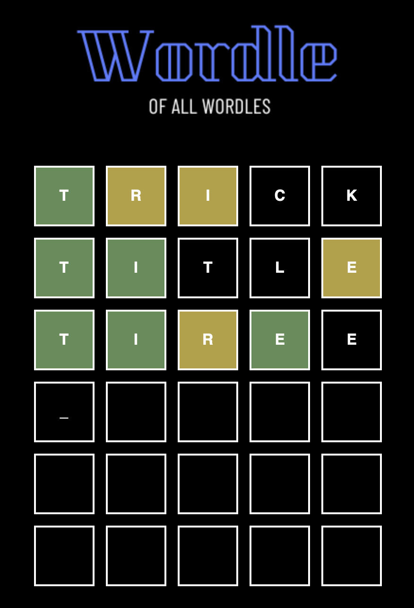
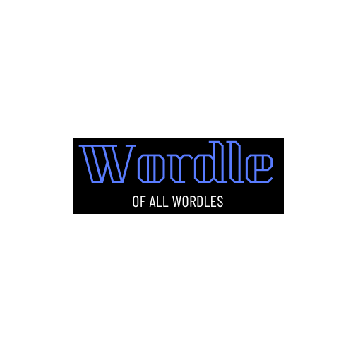

# CSI3140 - Wordle Design Document
This document will detail the design decisions made in creating our Wordle game, which will include structure of code and visual components.
> Project done by **Mustafa Ahmed** & **Justin Wang**

## Overview
This is our adaptation of Wordle, a popular New York Times game where user's must try to guess a five letter word in 6 attempts or less. \
Our game will follow the same rules: 
- You have 6 attempts to find the word. 
- In each guess, if there are letters in the word that exist in the actual word but in the wrong position, it will be highlighted yellow. 
- If it exists and is in the same position, it will be highlighted green.
<picture>
 <source media="(prefers-color-scheme: dark)" srcset="../docs/wordle_example.png">
 <source media="(prefers-color-scheme: light)" srcset="../docs/wordle_example.png">
 
</picture> 

## How to Play
Simply open our `index.html` file and start typing! Only letters will be accepted as inputs, press Enter to submit your guess and Backspace to remove a letter

  

## Structural Component Breakdown

### HTML
Our HTML file displays our board. We know that our board will be 6 rows and 5 columns, so the board was coded within our HTML file. Each block in each column was created in the HMTL file, with it's own set id, to keep track of each position in the JS document.

### Javascript
The JS file contains all the functionality for our game. It does checks for inputs, display output messages and keeps track of the game state.

We create an object called **WordleState** which keeps track of the following:
- The secret word
- The values of the grid created in HTML
- The current row and column 

These values are used by all functions in our program to check the actions and inputs done by the user. \

### CSS / Design
#### Colour palette
Our _colour palette_ stays true to the real Wordle game: 
- The background colour is **black** (`rgb(0, 0, 0)`)
- Our grid and text colour is **white** (`rgb(255, 255, 255)`)
- The **yellow** used to indicate the correct letter in the wrong place is the same as in the real game (`rgb(180,159,59)`)
    - This yellow contrasts the white of our letters and can be easily seen by users playing our game
- The **green** used to indicate the correct letter in the right place is the same as in the real game (`rgb(97,140,85)`) 

#### Font
Our _font_ used is sans-serif, **bolded**, CAPITALIZED, and in the colour white (`rgb(255, 255, 255)`).
- This is close to how the actual game is, the font is different but the other characteristics are still present in our adaptation

#### Assets
The only asset used for our project is a custom logo placed at the top of our game.

  

